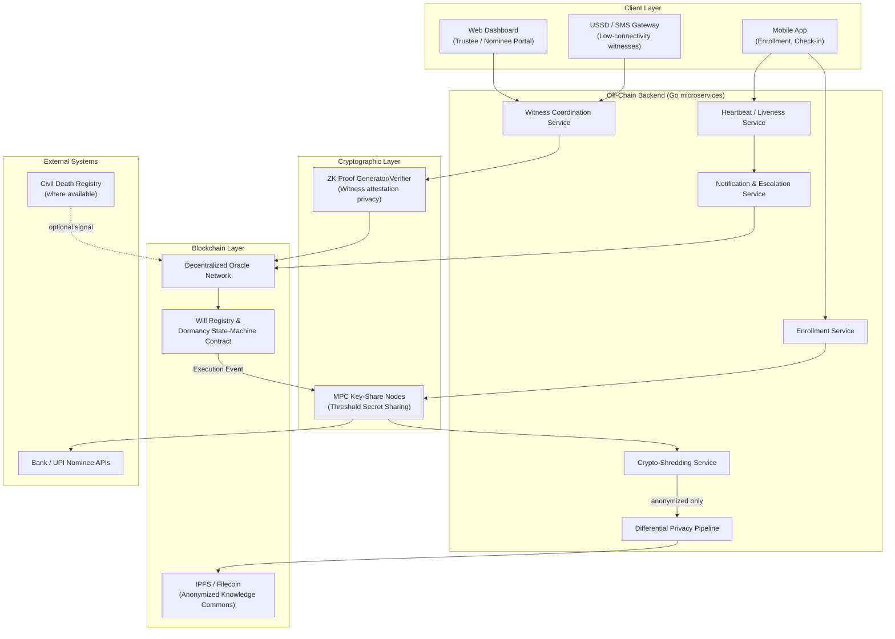
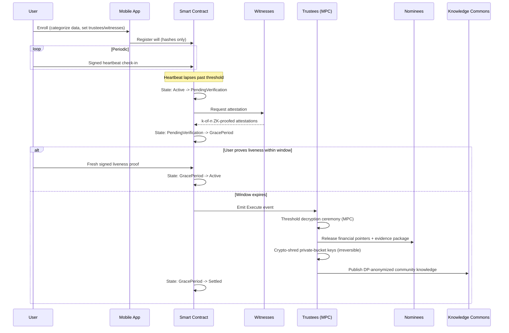
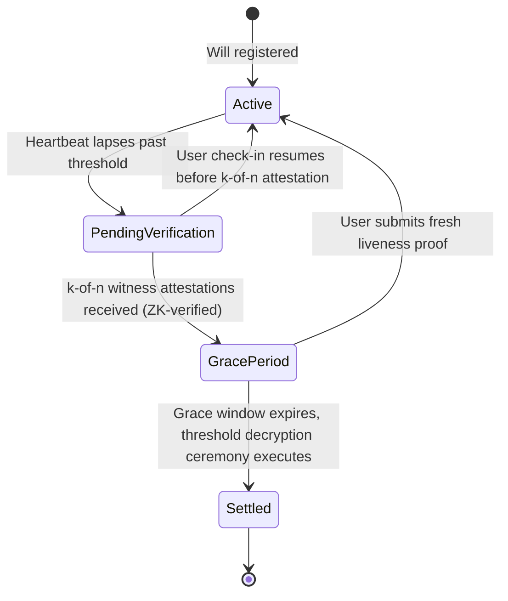

# Waaris — Decentralized Digital Legacy Vault

> **वारिस (vāris)** — Hindi/Urdu for *heir* or *inheritor*.
> A trust-minimized system for the graceful, verifiable handover of a person's digital life after death — without any single company, government, or individual ever holding the master key.

---

## Table of Contents

1. [Overview](#1-overview)
2. [The Problem](#2-the-problem)
3. [Core Design Principles](#3-core-design-principles)
4. [System Actors](#4-system-actors)
5. [High-Level Architecture](#5-high-level-architecture)
6. [Complete Lifecycle Flow](#6-complete-lifecycle-flow)
7. [Tech Stack](#7-tech-stack)
8. [Data Model](#8-data-model)
9. [Smart Contract State Machine](#9-smart-contract-state-machine)
10. [Cryptographic Design Deep-Dive](#10-cryptographic-design-deep-dive)
11. [Security & Threat Model](#11-security--threat-model)
12. [Legal & Regulatory Context (India)](#12-legal--regulatory-context-india)
13. [Repository Structure](#13-repository-structure)
14. [Local Development Setup](#14-local-development-setup)
15. [Roadmap](#15-roadmap)
16. [Contributing](#16-contributing)
17. [License & Disclaimer](#17-license--disclaimer)

---

## 1. Overview

When a person dies, their digital footprint — UPI wallets, email, social media, cloud drives, private chats, and years of accumulated knowledge — does not die with them. It sits scattered across dozens of platforms, locked behind passwords and 2FA that no one else can access. Families lose access to money. Communities lose access to knowledge (a grandmother's home-remedy notes, a farmer's pest-control log, an artisan's technique thread). Platforms are left holding data they have no legal clarity on how to handle.

**Waaris** is a decentralized "digital will" protocol that lets a person, while alive, define:

- **Who** gets access to what, after death (financial data → nominees, private data → nobody, community knowledge → the public)
- **How** death/permanent inactivity is verified (never by a single company or a single biometric scan)
- **What happens automatically** once verified — enforced by smart contracts, not by a support ticket to a company that may not exist in 20 years

It combines **multi-party computation (MPC)**, **zero-knowledge proofs (ZKPs)**, **blockchain-based smart contracts**, and **differential privacy** so that no central authority — including the Waaris protocol operators — ever holds a complete key or complete dataset.

---

## 2. The Problem

- **Legal ambiguity**: India's Digital Personal Data Protection Act, 2023 (DPDP Act) and the DPDP Rules, 2025 — notified on 13 November 2025 and rolling out in phases through May 2027 — define "personal data" and "Data Principal" rights, but do not squarely address what happens to that data once the Data Principal is deceased. Most global privacy frameworks share this gap: they are built around a *living* person's consent, and consent cannot be obtained from the dead.
- **Platform-by-platform chaos**: Google (Inactive Account Manager), Meta (Legacy Contact), and Apple (Digital Legacy) each solve this in isolated, proprietary, non-portable ways — and none of them touch UPI, net banking, or India-specific rails.
- **No graceful partial release**: Existing tools are binary — "hand over everything" or "delete everything." There is no mechanism to separate *financial* custody, *private* erasure, and *community-value* knowledge preservation.
- **Death verification is hard and dangerous to get wrong**: A false-positive "death" trigger that leaks a living person's private chats or drains their assets is catastrophic. A single biometric or a single relative's claim is not sufficient evidence.

---

## 3. Core Design Principles

1. **No single custodian.** No company, admin, or server ever holds a complete decryption key. Keys exist only as distributed shares (MPC) that are combined transiently, in a verifiable ceremony, only at the moment of legitimate execution.
2. **Multi-witness truth, not single-signal truth.** Inactivity is necessary but never sufficient. Death/incapacitation must be corroborated by independent, decorrelated witnesses before any irreversible action occurs.
3. **Reversibility until the last possible moment.** A time-locked grace/dispute window lets the user "come back to life" cryptographically (prove liveness) and halt execution — protecting against hospitalization, incarceration, lost devices, or malicious false triggers.
4. **Selective, category-aware release.**
   - Financial pointers → released to designated nominees, aligned with existing legal succession mechanisms.
   - Private communications → cryptographically shredded, not merely "deleted" — unrecoverable by design, including by Waaris itself.
   - Community-tagged knowledge → anonymized via differential privacy and published to a public, censorship-resistant commons.
5. **Privacy-by-architecture, not privacy-by-policy.** Sensitive plaintext never touches the blockchain. Only hashes, commitments, and zero-knowledge proofs are on-chain.
6. **Smart contracts execute logic, not law.** The protocol produces a cryptographically verifiable *evidence package* for use in probate/succession proceedings — it does not claim to replace statutory inheritance law.

---

## 4. System Actors

| Actor | Role |
|---|---|
| **Data Principal (User)** | The person creating the digital will while alive. Owns the root identity and initiates all configuration. |
| **Trustees** | 3–7 people (family + community leaders) who each hold one MPC key-share. A configurable threshold (e.g., 3-of-5) must cooperate to unlock any category of data. |
| **Witnesses** | Independent attestors (not necessarily trustees) who confirm long-term inactivity/death through an offline-friendly flow. Diversity is enforced — not all witnesses may share a household or single point of failure. |
| **Nominees / Legal Heirs** | Recipients of financial-asset pointers and the final evidence package for probate. |
| **Community Knowledge Commons** | The public — recipients of anonymized, differential-privacy-sanitized knowledge artifacts (e.g., farming techniques, craft skills) the user explicitly opted to share posthumously. |
| **Oracle Network** | Off-chain workers (potentially run by trustees themselves, or a decentralized oracle network) that relay real-world signals — heartbeat lapses, witness attestations, civil death-registry hits — onto the smart contract. |
| **Waaris Protocol** | The open-source software layer. Explicitly designed to hold **zero** custodial power — it coordinates, it does not custody. |

---

## 5. High-Level Architecture



**Key architectural decision**: heavy computation (MPC ceremonies, differential-privacy anonymization, NLP-based PII scrubbing) happens **off-chain**. The blockchain is used strictly as a tamper-evident coordination and state-transition layer — never as a data store for anything sensitive.

---

## 6. Complete Lifecycle Flow

### 6.1 Enrollment
The user creates a Digital Will through the mobile app:
- Classifies their digital assets into three buckets: **Financial** (UPI/bank/investment pointers), **Private** (chats, emails, photos not meant for anyone), and **Community-Shareable** (knowledge explicitly marked for posthumous public release).
- Nominates **Trustees** (m-of-n, e.g., 3-of-5) and independent **Witnesses**, enforcing diversity rules (not all from one household/village/employer) to reduce collusion risk.
- Sets the **inactivity threshold** (e.g., 6 or 12 months of no verifiable check-in) and the **grace/dispute window** (e.g., 30 days after dormancy is first flagged).

### 6.2 Key Splitting (MPC Ceremony)
The user's master encryption key is never stored whole, anywhere. It is split via **Shamir's Secret Sharing** into *n* shares distributed to trustees and one share held in a smart-contract-gated escrow. Reconstructing or using the key requires a **threshold** number of shares to cooperate in a live MPC ceremony — no party, including Waaris infrastructure, ever sees the assembled key.

### 6.3 Liveness Check-ins
The user performs lightweight periodic cryptographic check-ins (a signed "heartbeat," similar in spirit to a dead-man's switch) from their device. Missed check-ins trigger escalating reminders (push, SMS, email) well before any dormancy logic activates.

### 6.4 Dormancy Detection
Once the inactivity threshold lapses with no heartbeat, the on-chain state machine moves from `Active` to `PendingVerification`. This is a signal of *possible* dormancy, not proof of death — it only opens the verification workflow.

### 6.5 Witness Verification (Zero-Knowledge Attestation)
The Witness Coordination Service reaches out to the designated witnesses through the app or a **USSD/SMS fallback** (critical for rural community leaders who may not own smartphones — directly relevant to the craft/farming-knowledge use case). Each witness independently attests to long-term inactivity or confirmed death. A **zero-knowledge proof** lets a witness prove "I am a registered, valid witness for this will, and I attest to dormancy" **without revealing witness identity on the public chain** — protecting witnesses (often elderly community members) from public exposure or targeted harassment. A **k-of-n** threshold of decorrelated witness attestations (e.g., 2-of-3, spanning family + community + optionally a civil registry hit) is required to proceed.

### 6.6 Grace / Dispute Window
A time-locked challenge period (e.g., 30 days) opens. If the user is alive, a single fresh, signed liveness proof from their device immediately halts execution and resets the state machine to `Active`. This window exists specifically to defend against premature or malicious triggering.

### 6.7 Execution (Threshold Decryption Ceremony)
If the grace window expires unchallenged, the smart contract emits an `Execute` event. Trustees are notified and, if a threshold of them agree, participate in a live **threshold decryption ceremony** — the full key is never reconstructed in one place; instead threshold cryptography (e.g., threshold BLS/ElGamal) lets the group jointly decrypt only the specific data bucket being released, category by category:

- **Financial**: decrypted pointers (account references, nominee instructions) are packaged with the on-chain attestation trail and delivered to nominees and, where applicable, submitted through existing bank/UPI/NPCI nominee-claim processes. *The smart contract cannot itself move money out of UPI/bank rails — it produces the verifiable evidence package that supports the legal nominee claim.*
- **Private**: the encryption keys for this bucket were **never escrowed with anyone** — they are cryptographically shredded on execution (the Data Encryption Key is deleted), making the ciphertext permanently unrecoverable. This is intentional: privacy for private data means *nobody* gets it, including trustees.
- **Community-Shareable**: only content the user explicitly tagged during enrollment proceeds to the anonymization pipeline (6.8).

### 6.8 Differential Privacy Anonymization
Tagged community knowledge (e.g., a farming technique, a craft method) is passed through:
1. An NLP-based PII scrubber that strips names, locations, and other identifying entities.
2. A **differential privacy** layer that adds calibrated noise/generalization and enforces an epsilon-budget so that even aggregate publication cannot be used to re-identify the original author via stylistic or contextual fingerprinting.
3. A lightweight human review queue (trustees can flag anything that still feels identifying) before publication.

The sanitized artifact is pinned to **IPFS/Filecoin** and indexed in a public, searchable Knowledge Commons — attributed only as "a community contribution," never to a named individual.

### 6.9 Post-Execution Audit
The will is marked `Settled` on-chain. An immutable audit trail (witness attestation hashes, execution timestamps, trustee participation — never raw personal data) remains available to nominees and legal heirs as supporting evidence for formal probate/succession proceedings.



---

## 7. Tech Stack

### 7.1 Client Layer
| Component | Technology | Why |
|---|---|---|
| Mobile app | **React Native** (or Flutter) | Single codebase, works on the low-to-mid-range Android devices most likely to be used by elderly trustees/witnesses |
| Web dashboard (trustee/nominee portal) | **React + TypeScript**, TailwindCSS | Fast iteration, strong typing for a security-sensitive UI |
| Offline-first sync | **SQLite + CRDT-based sync (Automerge)** | Witness attestations must work in low-connectivity rural areas and sync once connectivity returns |
| Low-tech accessibility | **USSD / SMS gateway** (Twilio or a local telco aggregator) | Signed OTP-based attestation flow for witnesses without smartphones |

### 7.2 Backend / Core Services
| Component | Technology | Why |
|---|---|---|
| Microservices | **Go (Golang)**, gRPC internal / REST-GraphQL external | High concurrency for heartbeat fan-out at scale; strong typing for a system where correctness is non-negotiable |
| Relational metadata store | **PostgreSQL** | Trustee/witness lists, attestation status, timestamps — never raw sensitive plaintext |
| Cache / heartbeat store | **Redis** | Fast check-in writes, TTL-based dormancy pre-checks |
| Event backbone | **NATS / Apache Kafka** | Decouples dormancy-detection from execution and notification pipelines |
| Orchestration | **Kubernetes** (with HPA) | Autoscale the notification/witness-coordination services during mass check-in windows |
| Observability | **Prometheus + Grafana** | Uptime of the heartbeat pipeline is mission-critical — a false dormancy trigger is catastrophic |

### 7.3 Cryptographic Layer
| Component | Technology | Why |
|---|---|---|
| Threshold secret sharing | **Shamir's Secret Sharing** | Splits the master key across trustees; no single share reveals anything |
| Threshold signing/decryption | **FROST (threshold Schnorr) / threshold BLS** | Lets trustees jointly sign/decrypt without ever reconstructing the full key in one place |
| Zero-knowledge proofs | **gnark** (Go-native zk-SNARK library) or **circom + snarkjs** | Witnesses prove valid attestation without revealing identity on a public chain |
| Envelope encryption | **libsodium / age** | Per-category Data Encryption Keys (DEKs), enabling clean crypto-shredding of the private bucket |
| Crypto-shredding | Custom Go service | "Deleting" private data = deleting its DEK — mathematically irrecoverable, auditable |

### 7.4 Blockchain / Smart Contract Layer
| Component | Technology | Why |
|---|---|---|
| Settlement chain | **Polygon / Arbitrum (Ethereum L2)** or a purpose-built **Cosmos SDK app-chain** | Low gas costs for frequent heartbeat-adjacent events; app-chain option if full protocol sovereignty is desired |
| Smart contracts | **Solidity** (EVM path) or **CosmWasm/Rust** (Cosmos path) | Will registry, dormancy state machine, ZK-attestation verifier |
| Oracle network | **Chainlink-style decentralized oracle**, or a custom oracle set operated by the trustees themselves | Bridges off-chain witness/registry signals onto the contract without a single trusted relayer |
| Decentralized storage | **IPFS + Filecoin** | Content-addressed, censorship-resistant home for the anonymized Knowledge Commons |

### 7.5 Privacy & Data Governance Layer
| Component | Technology | Why |
|---|---|---|
| Differential privacy engine | **OpenDP** or Google's differential-privacy library | Epsilon-budgeted noise/generalization before any community knowledge publication |
| PII scrubbing | **spaCy NER** (or a small fine-tuned model) | Strips names/locations from free-text knowledge entries pre-anonymization |
| Data classification (enrollment-time) | Rules engine + lightweight ML classifier | Helps users correctly tag content as Financial / Private / Community-Shareable |

### 7.6 Identity & Verification
| Component | Technology | Why |
|---|---|---|
| Trustee/witness identity | **W3C Decentralized Identifiers (DID) + Verifiable Credentials** | Portable, cryptographically verifiable attestations not tied to one platform account |
| Liveness signal (one factor among several) | Device-level biometric (FaceID/fingerprint) | Used only as *one* check-in factor — never the sole trigger, and never stored centrally, to avoid DPDP-sensitive biometric-template retention risk |

### 7.7 DevOps / Infrastructure
| Component | Technology |
|---|---|
| Containerization | Docker |
| Orchestration | Kubernetes |
| CI/CD | GitHub Actions |
| Infrastructure as Code | Terraform |
| Operational secrets (infra-only, never user vault secrets) | HashiCorp Vault |

---

## 8. Data Model

Only non-sensitive metadata and content hashes are ever persisted server-side or on-chain. Actual plaintext lives client-side or in per-category encrypted buckets.

```go
type User struct {
    ID              uuid.UUID
    PublicKeyHash   string    // commitment, not the key itself
    LastHeartbeatAt time.Time
    DormancyDays    int       // configured inactivity threshold
    GraceDays       int       // dispute window length
    State           WillState // Active | PendingVerification | GracePeriod | Settled
}

type DataCategory string
const (
    Financial          DataCategory = "financial"
    Private            DataCategory = "private"
    CommunityShareable DataCategory = "community_shareable"
)

type TrusteeShare struct {
    UserID       uuid.UUID
    TrusteeDID   string // W3C DID
    ShareIndex   int
    ShareCommit  string // commitment to the Shamir share, not the share itself
}

type WitnessAttestation struct {
    UserID        uuid.UUID
    WitnessDIDHash string   // hashed for on-chain privacy
    ZKProof       []byte    // proves valid + eligible witness, without revealing identity
    AttestedAt    time.Time
    Channel       string    // app | sms | ussd
}

type ExecutionEvent struct {
    UserID        uuid.UUID
    Category      DataCategory
    TriggeredAt   time.Time
    TxHash        string    // on-chain execution transaction
    OutcomeHash   string    // hash of the resulting evidence package
}

type CommunityKnowledgeArtifact struct {
    ID              uuid.UUID
    IPFSHash        string
    EpsilonBudget   float64  // differential privacy budget consumed
    ReviewedByTrusteeIDs []uuid.UUID
    PublishedAt     time.Time
}
```

---

## 9. Smart Contract State Machine



The contract exposes (conceptually, EVM-style pseudocode):

```solidity
interface IWillRegistry {
    function registerWill(bytes32 metadataHash, address[] calldata trustees, uint8 threshold) external;
    function heartbeat(bytes calldata signedProof) external;
    function submitWitnessAttestation(bytes calldata zkProof) external;
    function submitLivenessProof(bytes calldata signedProof) external; // halts execution during grace period
    function execute() external; // callable only after grace window expiry
    function getState(address user) external view returns (WillState);
}
```

---

## 10. Cryptographic Design Deep-Dive

- **Why MPC over a single escrow key?** A single escrowed key — even one held by a "trusted" foundation — is a single point of compromise, coercion, or company failure. Threshold secret sharing means an attacker (or a rogue trustee) needs to compromise a *quorum*, not one party.
- **Why ZK proofs for witnesses specifically?** Requiring witnesses to sign publicly on-chain would expose often-elderly community members' identities and locations permanently and publicly — a real safety concern. A ZK proof lets a witness prove "I am one of this user's registered, eligible witnesses and I attest to dormancy" while keeping *which* witness it was, and their personal details, off the public ledger entirely.
- **Why crypto-shredding for private data instead of a "delete" API call?** Database deletes are recoverable from backups, replicas, and logs. Deleting the encryption key for a bucket makes the ciphertext permanently unrecoverable — mathematically, not just administratively — which is the honest guarantee "your private chats will never be read by anyone" requires.
- **Why differential privacy for community knowledge instead of simple anonymization?** Stripping names is not enough — writing style, unique phrasing, and specific contextual details can re-identify a contributor (a known weakness of naive anonymization). Differential privacy adds calibrated noise/generalization with a provable mathematical bound on re-identification risk.

---

## 11. Security & Threat Model

| Threat | Mitigation |
|---|---|
| Single trustee compromised/coerced | Threshold (m-of-n) requirement — no single trustee can unlock anything alone |
| Trustee collusion | Diversity enforcement at enrollment (trustees/witnesses must not all share a household, employer, or location) |
| Premature/malicious dormancy trigger | Two-layer defense: k-of-n independent witness attestation **and** a time-locked grace window with liveness override |
| Sybil witnesses | DID-based identity + optional reputation/stake weighting |
| On-chain data leakage | Only hashes, commitments, and ZK proofs ever touch the chain — never plaintext PII |
| Platform operator turns malicious or shuts down | By design, Waaris infrastructure never holds a complete key or a complete dataset — there is nothing for the operator to hand over or misuse even if compelled |
| Re-identification of "anonymized" community knowledge | Differential privacy with an enforced epsilon budget, plus human trustee review before publication |
| Immutable blockchain conflicting with "right to erasure" | Architectural separation: erasable ciphertext lives off-chain; only non-reversible hashes/state live on-chain |

---

## 12. Legal & Regulatory Context (India)

- The **Digital Personal Data Protection Act, 2023 (DPDP Act)** and the **DPDP Rules, 2025** — notified by MeitY on 13 November 2025 — form India's core data protection framework, with obligations phasing in through **May 2027** and the Data Protection Board of India already established. As of this writing, neither the Act nor the Rules explicitly define post-mortem data rights for deceased Data Principals — this is precisely the ambiguity Waaris is designed to operate safely within, by defaulting to the most protective interpretation (minimize what's retained, delete what's private, never assume implied consent).
- **Smart contract execution ≠ legal transfer of title.** Financial-asset "release" produces a verifiable evidence package (attestations, timestamps, cryptographic proof of the will's terms) intended to *support* — not replace — claims made through existing legal successor mechanisms (e.g., nomination under banking/insurance regulations, or probate/succession under the **Indian Succession Act, 1925**).
- **Biometric data is treated as maximally sensitive.** It is used only as one liveness-check factor, is never stored centrally, and is never the sole basis for a dormancy determination.

> **This project is a technical architecture, not legal advice.** Any real deployment requires review by qualified legal counsel in every jurisdiction it operates in.

---

## 13. Repository Structure

```
waaris/
├── apps/
│   ├── mobile/                # Reserved for React Native enrollment + check-in app
│   └── web-dashboard/         # React + TypeScript + Tailwind trustee / nominee portal
├── platform/                  # Shared Go infrastructure primitives (no domain logic)
├── services/
│   ├── enrollment/            # Go — will creation, category tagging
│   ├── heartbeat/             # Go — liveness check-in ingestion
│   ├── witness-coordination/  # Go — ZK-backed attestation flow, USSD/SMS bridge
│   ├── notification/          # Go — escalation reminders
│   ├── dp-pipeline/           # Python — differential privacy + PII scrubbing
│   └── crypto-shredding/      # Go — DEK lifecycle management
├── contracts/
│   ├── WillRegistry.sol
│   ├── DormancyStateMachine.sol
│   └── ZKAttestationVerifier.sol
├── crypto/
│   ├── mpc/                   # threshold secret sharing, FROST/BLS
│   └── zk-circuits/           # gnark / circom circuits for witness proofs
├── infra/
│   ├── migrations/            # Versioned PostgreSQL SQL migrations
│   ├── terraform/             # Reserved for infrastructure as code
│   └── k8s/                   # Reserved for deployment manifests
├── docker-compose.yml          # Local PostgreSQL, Redis, Mailpit, migrations, services, web
├── Makefile                    # Common local development commands
└── docs/
    └── architecture/
```

---

## 14. Local Development Setup

```bash
# Clone
git clone https://github.com/<org>/waaris.git && cd waaris

# Bootstrap local environment and web dependencies
cp .env.example .env
make bootstrap

# Run quality checks (Go formatting/vet/tests; web formatting/lint/tests/build)
make check

# Start PostgreSQL, Redis, Mailpit, migrations, backend service shells, and web dashboard
make up

# Inspect local services
make ps
# Web dashboard: http://localhost:3000
# Mailpit: http://localhost:8025
# Enrollment health: http://localhost:8081/healthz
```

The initial Go services expose only `/healthz` and `/readyz`; no business, cryptographic, blockchain, or sensitive-data behavior is available in the foundation milestone. Docker Desktop (or another Docker daemon) must be running before `make up`.

---

## 15. Roadmap

- [ ] **Phase 1 — MVP**: Enrollment + heartbeat check-in + single-witness (non-ZK) dormancy flow on a local testnet
- [ ] **Phase 2**: MPC key-splitting integration (Shamir's Secret Sharing) for the private-data bucket
- [ ] **Phase 3**: ZK-proofed witness attestation (gnark circuits) + USSD/SMS accessibility bridge
- [ ] **Phase 4**: Differential privacy pipeline for community knowledge + IPFS publication
- [ ] **Phase 5**: Testnet deployment of the full smart contract state machine on Polygon/Arbitrum
- [ ] **Phase 6**: Legal partnership pilot (mapping evidence packages to real nominee/probate workflows)
- [ ] **Phase 7**: Security audit + mainnet / production readiness

---

## 16. Contributing

Contributions are welcome, especially from people with backgrounds in applied cryptography (MPC/ZK), differential privacy, blockchain smart contract security, and — critically — legal/policy expertise in Indian data protection and succession law. Given the sensitivity of the domain, all contributions touching the cryptographic or dormancy-detection logic should include a written threat-model note alongside the PR.

---

## 17. License & Disclaimer

Licensed under the MIT License (see `LICENSE`).

**Disclaimer**: Waaris is a technical architecture and reference implementation. It is not a law firm, not a bank, and not a substitute for a legally executed will, nomination, or probate process. Anyone deploying this system in production should engage qualified legal counsel in each relevant jurisdiction before enabling real financial-asset or private-data handling.
